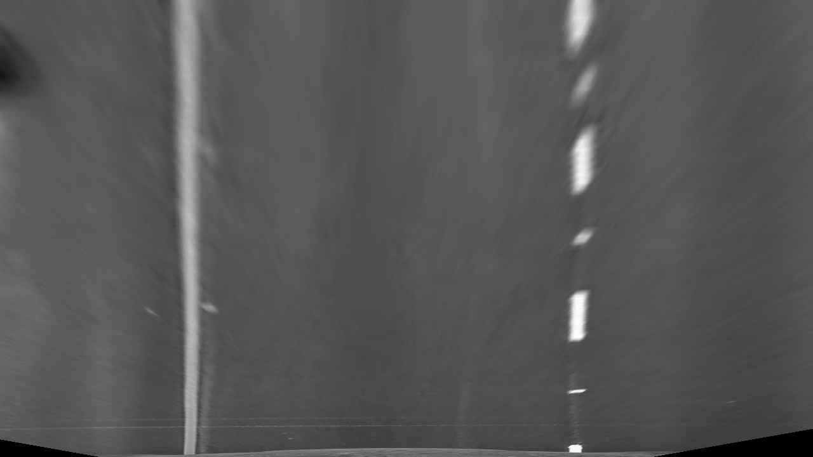
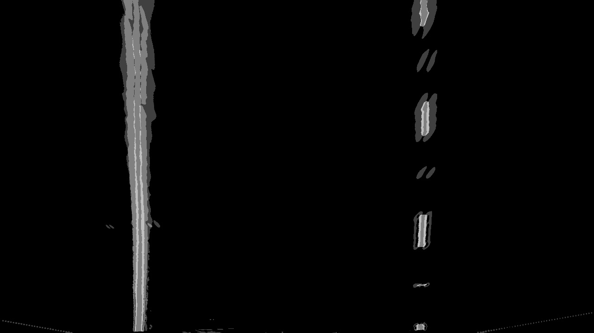

## Advanced Lane Finding

---

**Advanced Lane Finding Project**

The goals / steps of this project are the following:

* Compute the camera calibration matrix and distortion coefficients given a set of chessboard images.
* Apply a distortion correction to raw images.
* Use color transforms, gradients, etc., to create a thresholded binary image.
* Apply a perspective transform to rectify binary image ("birds-eye view").
* Detect lane pixels and fit to find the lane boundary.
* Determine the curvature of the lane and vehicle position with respect to center.
* Warp the detected lane boundaries back onto the original image.
* Output visual display of the lane boundaries and numerical estimation of lane curvature and vehicle position.


## Rubric Points

---

### Writeup / README

#### 1. Provide a Writeup / README.  

Here it is :-)

### Camera Calibration

Code available in the python [notebook](./Advanced Lane Finding.ipynb)

#### 1. Briefly state how you computed the camera matrix and distortion coefficients. Provide an example of a distortion corrected calibration image.

As the first step I have calibrated the camera using the chessboard images. For that I have
used the OpenCV method ```findChessboardCorners``` to collect corner points and object points.

Then I have used ```calibrateCamera``` method to get the camera matrix and distortion coefficiencts.

Calibration image before:
[./processed/chess_before.png]

Calbiration image after undistortion:
[./processed/chess_after.png]

### Pipeline (single images)

This is the frame used in the demostration of pipeline:
[./processed/original.jpg]

#### 1. Provide an example of a distortion-corrected image.

First step of the pipeline is the image undistortion done based on the parameters obtained
from the camera calibration step. Example frame after removing distortion:
[./processed/undistorted.jpg]


#### 2. Describe how (and identify where in your code) you used color transforms, gradients or other methods to create a thresholded binary image.  Provide an example of a binary image result.

To create a thresholded binary image I have used the following methods:
* ```l_channel``` which extracts the L channel from HLS model
* ```b_channel``` which extracts the B channel from LAB model
* ```v_channel``` which extracts the V channel from HSV model
* ```clahe``` which applies the contrast limited adaptive historgram to bring out more details from the channels
* ```binary_image``` which gets a binary treshold of provided image (applied on all the channels)
* ```sobel``` which applies the sobel operator to a given channel

The general process of obtaining the binary thresholded image is:
* get the birsdeye view image first
* extract L, B and V channels
* apply CLAHE on the extracted channels
* convert the result into binary image
* apply sobel operator on the V channel and turn into a binary one
* combine all 4 binary images and normalize it to obtain the final binary thresholded image

Example steps based on the test frame:

L channel


L channel CLAHE


L channel binary


B channel


B channel CLAHE


B channel binary


V channel


V channel CLAHE


V channel binary


Sobel


Combined


#### 3. Describe how (and identify where in your code) you performed a perspective transform and provide an example of a transformed image.

The code for my perspective transform includes a function called `warper()`, which appears in lines 1 through 8 in the file `example.py` (output_images/examples/example.py) (or, for example, in the 3rd code cell of the IPython notebook).  The `warper()` function takes as inputs an image (`img`), as well as source (`src`) and destination (`dst`) points.  I chose the hardcode the source and destination points in the following manner:

```python
src = np.float32(
    [[(img_size[0] / 2) - 55, img_size[1] / 2 + 100],
    [((img_size[0] / 6) - 10), img_size[1]],
    [(img_size[0] * 5 / 6) + 60, img_size[1]],
    [(img_size[0] / 2 + 55), img_size[1] / 2 + 100]])
dst = np.float32(
    [[(img_size[0] / 4), 0],
    [(img_size[0] / 4), img_size[1]],
    [(img_size[0] * 3 / 4), img_size[1]],
    [(img_size[0] * 3 / 4), 0]])
```

This resulted in the following source and destination points:

| Source        | Destination   | 
|:-------------:|:-------------:| 
| 585, 460      | 320, 0        | 
| 203, 720      | 320, 720      |
| 1127, 720     | 960, 720      |
| 695, 460      | 960, 0        |

I verified that my perspective transform was working as expected by drawing the `src` and `dst` points onto a test image and its warped counterpart to verify that the lines appear parallel in the warped image.

![alt text][image4]

#### 4. Describe how (and identify where in your code) you identified lane-line pixels and fit their positions with a polynomial?

Then I did some other stuff and fit my lane lines with a 2nd order polynomial kinda like this:

![alt text][image5]

#### 5. Describe how (and identify where in your code) you calculated the radius of curvature of the lane and the position of the vehicle with respect to center.

I did this in lines # through # in my code in `my_other_file.py`

#### 6. Provide an example image of your result plotted back down onto the road such that the lane area is identified clearly.

I implemented this step in lines # through # in my code in `yet_another_file.py` in the function `map_lane()`.  Here is an example of my result on a test image:

![alt text][image6]

---

### Pipeline (video)

#### 1. Provide a link to your final video output.  Your pipeline should perform reasonably well on the entire project video (wobbly lines are ok but no catastrophic failures that would cause the car to drive off the road!).

Here's a [link to my video result](./project_video.mp4)

---

### Discussion

#### 1. Briefly discuss any problems / issues you faced in your implementation of this project.  Where will your pipeline likely fail?  What could you do to make it more robust?

Here I'll talk about the approach I took, what techniques I used, what worked and why, where the pipeline might fail and how I might improve it if I were going to pursue this project further.  
