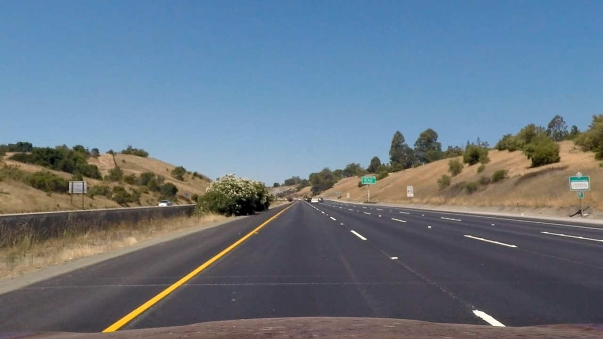
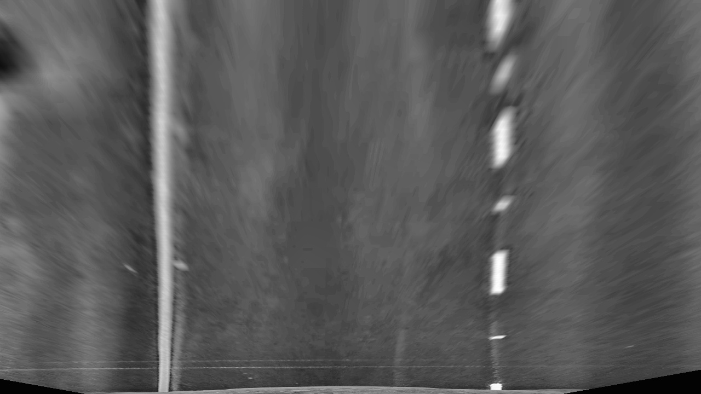
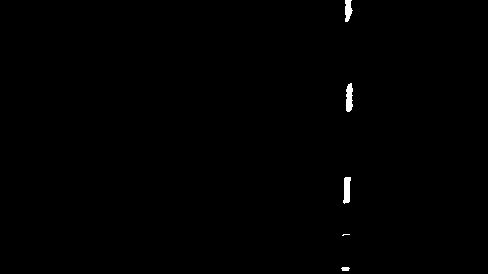
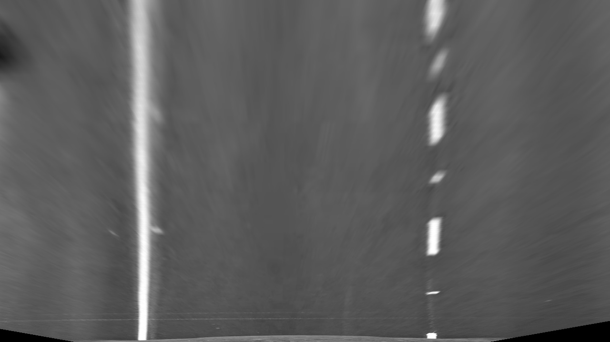
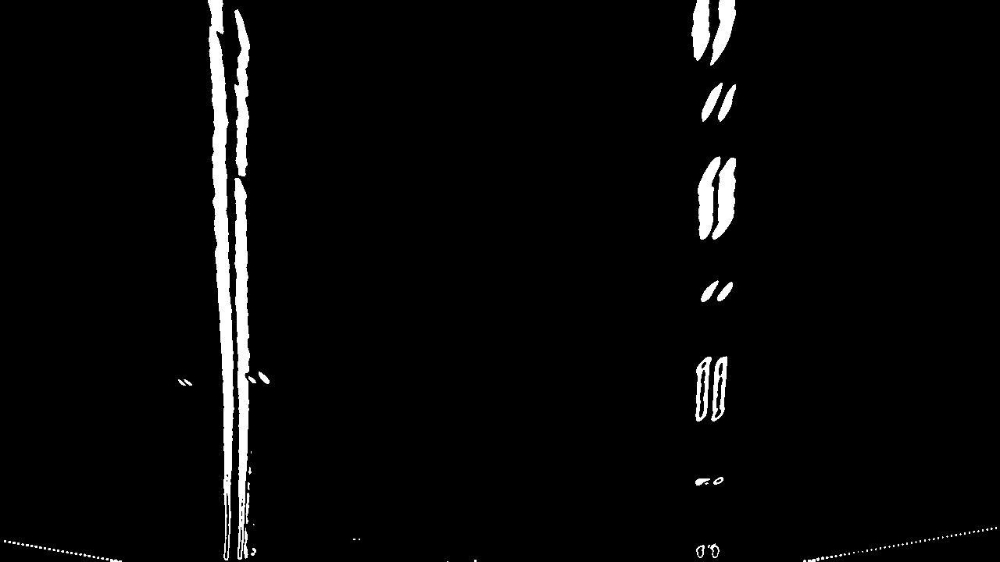
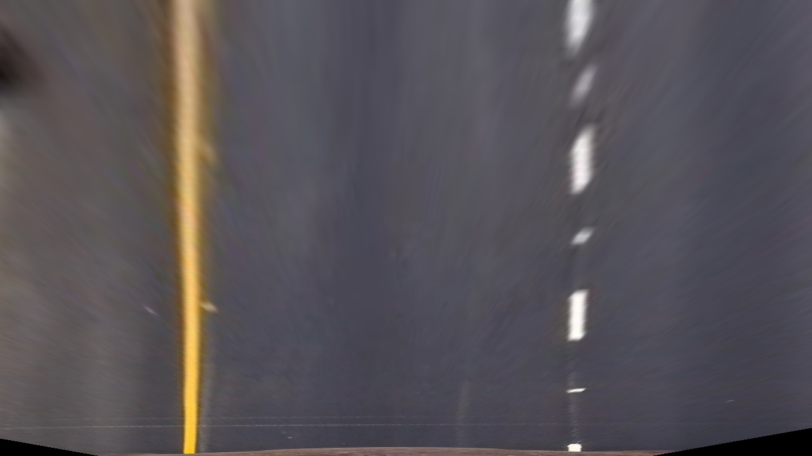

## Advanced Lane Finding

---

**Advanced Lane Finding Project**

The goals / steps of this project are the following:

* Compute the camera calibration matrix and distortion coefficients given a set of chessboard images.
* Apply a distortion correction to raw images.
* Use color transforms, gradients, etc., to create a thresholded binary image.
* Apply a perspective transform to rectify binary image ("birds-eye view").
* Detect lane pixels and fit to find the lane boundary.
* Determine the curvature of the lane and vehicle position with respect to center.
* Warp the detected lane boundaries back onto the original image.
* Output visual display of the lane boundaries and numerical estimation of lane curvature and vehicle position.

## Changes after first review
* transformation to birds eye view had incorrect parameter. Improving that helped to get better results for lane finding
* pixel to meter conversion has been fixed after fixing the transformation
* there was a mistake in calculating the lane curvature: subtraction instead of addition and missing parenthesis

## Rubric Points

---

### Writeup / README

#### 1. Provide a Writeup / README.  

Here it is :-)

### Camera Calibration

Code available in the python [notebook](./Advanced Lane Finding.ipynb)

#### 1. Briefly state how you computed the camera matrix and distortion coefficients. Provide an example of a distortion corrected calibration image.

As the first step I have calibrated the camera using the chessboard images. For that I have
used the OpenCV method ```findChessboardCorners``` to collect corner points and object points.

Then I have used ```calibrateCamera``` method to get the camera matrix and distortion coefficiencts.

Calibration image before:


Calbiration image after undistortion:


### Pipeline (single images)

This is the frame used in the demostration of pipeline:


#### 1. Provide an example of a distortion-corrected image.

First step of the pipeline is the image undistortion done based on the parameters obtained
from the camera calibration step. Example frame after removing distortion:




#### 2. Describe how (and identify where in your code) you used color transforms, gradients or other methods to create a thresholded binary image.  Provide an example of a binary image result.

To create a thresholded binary image I have used the following methods:
* ```l_channel``` which extracts the L channel from HLS model
* ```b_channel``` which extracts the B channel from LAB model
* ```v_channel``` which extracts the V channel from HSV model
* ```clahe``` which applies the contrast limited adaptive historgram to bring out more details from the channels
* ```binary_image``` which gets a binary treshold of provided image (applied on all the channels)
* ```sobel``` which applies the sobel operator to a given channel

The general process of obtaining the binary thresholded image is:
* get the birsdeye view image first
* extract L, B and V channels
* apply CLAHE on the extracted channels
* convert the result into binary image
* apply sobel operator on the V channel and turn into a binary one
* combine all 4 binary images and normalize it to obtain the final binary thresholded image

Example steps based on the test frame:

L channel


L channel CLAHE



L channel binary



B channel


B channel CLAHE


B channel binary


V channel



V channel CLAHE


V channel binary


Sobel



Combined


#### 3. Describe how (and identify where in your code) you performed a perspective transform and provide an example of a transformed image.

The code for my perspective transform includes a function called `perspective_transform(img)`. 
I chose the hardcode the source and destination points in the following manner:

```python
    src = np.float32(
        [[308, 687],
         [1129, 687],
         [555, 455],
         [735, 455]]
    )
    
    dst = np.float32(
        [[300, 720],
         [1130, 720],
         [300, 1],
         [1130, 1]]
    )
```

The following image presents the birds eye view on the test frame:



#### 4. Describe how (and identify where in your code) you identified lane-line pixels and fit their positions with a polynomial?

For finding the lanes I used the method presented in the lecture. It's implementation is in method `fit_lanes`

To identify the place where the possible lane is I used a historgram for bottom half of the picture building in on a sum of pixels
along the columns. I find a peek point on both sides of the image. Then I used a sliding window to go up the image and find the next portion
of matching pixels. To identify another matching region I look at the amount of pixels within the checked region and see if it matches 
the required ratio and that are within the defined margin. Also I identify the position for the next window.

The following image ilustrates the result of this method:


#### 5. Describe how (and identify where in your code) you calculated the radius of curvature of the lane and the position of the vehicle with respect to center.

The curvature of the road is calculated following the lecture suggestions and can be found also in `fit_lanes` method.
 
The curvature is calculated by fiting the polynomial and taking into accout the ratio of lane sizes into pixels on camera image and then 
calculating the radius from the provided formula.

Results are presented on the image below.

#### 6. Provide an example image of your result plotted back down onto the road such that the lane area is identified clearly.

Method used to plot the lines back onto the original image as well as print the curvature is `draw_lines`. It also follows the method 
presented in the lecture:
* create a blank image of the size of warped image
* Create a poly using refitted x and y points
* unwarp the image using the inverse matrix
* apply the weighted image onto the original frame
* print the curvature on the original frame

And the result looks like this:


---

### Pipeline (video)

#### 1. Provide a link to your final video output.  Your pipeline should perform reasonably well on the entire project video (wobbly lines are ok but no catastrophic failures that would cause the car to drive off the road!).

Here's a [link to my video result](./output/project_video.mp4)

I have tried my solution on challenge videos. The results are not that great but here they are for the reference:
* [challenge video](./output/challenge_video.mp4)
* [harder challenge video](./output/harder_challenge_video.mp4)

---

### Discussion

#### 1. Briefly discuss any problems / issues you faced in your implementation of this project.  Where will your pipeline likely fail?  What could you do to make it more robust?

So far this was the most challenging project in the term, mostly due to different corner cases - even though the base video is still fairly simple
one and does not present so many challenges as the other videos. Runing my code on the challenge and harder challenge video shows the deficiencies of
my solution.

During the course of test runs I have identified and extracted a few tricky frames from the video to easier verify my pipeline on edge cases.

To get it running on the base video first I faced the following challenges:
* identifing the useful transformation took some time especially when trying to figure out the right combination of color spaces and values of thresholds. Initially I started playing with grayscale image and enchancing yellow and white color using HSV color space as in the previous lane finging project. However this time it did not give me satisfying results
* later I started playing around with gradients and different combinations of them. I tried to use them in combination as the lectures were very suggestive on this solution. However I couldn't find the right combination of them and right parameters to remove the excesive noise
* after reading some suggestions from other students I started playing with LAB, HLS and HSV color spaces and enchancing them using the CLAHE method. However I still couldn't get the result I expected.
* as a next step I started to combine the above results with results of Sobel operator as it show good binary results for the tricky frames. Still the results was not as I expected.
* at that moment I started carefully reviewing my code and I found the issue: as I used OpenCV to load test images it was all adjusted to BGR colorspace and video processing was done on RGB frame. After fixing that I started to get reasonable results.

The generated video gives reasonable results but it is not perfect. As I spent a lot of time of getting proper binary images and debugging the colorspace mismatch issue I didn't explore in depth methods of finding the lanes. It is always done based on the histogram only and from scratch on every frame. The next things I would try to improve the solution would be to:
* use convolutions to identify the position of lines. This would help to find the place of line for big curves and dashed lanes when the first visible dash appears far from the vehicle (you can observe this issue in current solution)
* remove false positives from the identified sliding windows to avoid skippy lines
* reuse line position from previous frame to reduce line skippines as well

The issues mentioned above are expecially visible in the harder challenge video. I hope to get some time soon to experiment more with it.
